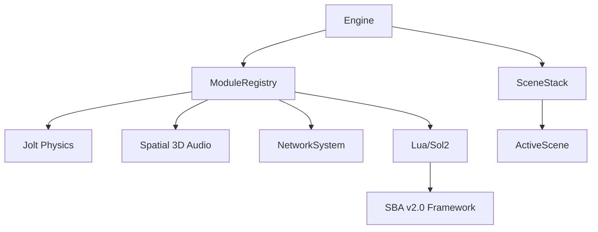

# Starlight Engine (Fusion Core)

> **Este projeto é feito por IA e só o prompt é feito por um humano.**

A **Starlight Engine** é o núcleo tecnológico do ecossistema Fusion. Uma framework de simulação de alto desempenho em C++20 moderno com design **Entity-Component-System (ECS)** e Sub-sistemas Desacoplados.

## ⚙️ Arquitetura C++



### 1. ECS (Entity Component System)
- **EnTT** para memória contígua e iterações cache-friendly.
- Componentes: `TransformComponent`, `MeshComponent`, `PointLightComponent`, `AudioComponent`, `LuaScriptComponent`.

### 2. RenderGraph (OpenGL)
- **PBR** (Physically Based Rendering) com metallic/roughness workflow.
- **Cascaded Shadow Maps** (4 cascatas, 2048x2048).
- **Renderer2D** otimizado para batch rendering de UI e sprites.
- **Post-Processing**: SSAO, SSR, Bloom, ACES Tone Mapping.
- **GPU Culling** e Frustum Culling em fases nativas.

### 3. Scripting (Lua / Sol2)
O **ScriptSystem** expõe toda a engine para Lua, permitindo gameplay sem recompilação C++:
- Tabelas globais: `Engine`, `gfx`, `input`, `window`, `audio`, `assets`, `imgui`, `time`
- **3D Mouse Raycasting**: `Engine.get_mouse_hit()`
- **Light Control**: `Engine.set_light_color()`, `Engine.set_light_intensity()`
- **Entity Management**: `Engine.spawn()`, `Engine.set_pos()`, `Engine.set_color()`

### 4. InputSystem
- SDL2 com **Binding de Ações** semânticas (`"W"` → `"Up"`, `"MouseLeft"` → ação).
- Suporte a `is_down()`, `is_just_pressed()`, `get_mouse_x/y()`.

### 5. JobSystem (Multi-threading)
- **Wicked Engine JobSystem** com fiber-based task switching.
- Worker threads auto-escalados para CPU cores disponíveis.

## 🎮 SBA v2.0 — Starlight Bridge API

O SDK Lua de alto nível está em `assets/scripts/`:

| Arquivo | Função |
|---------|--------|
| `core.lua` | Standard Library: Class, MathX(11fn), Physics2D(4fn), Timer v2, Color, ScreenShake, ValueTween |
| `sba_bridge.lua` | Game SDK: Entity OO, Light OO, Tween(8 easings), Scene Manager, Event Bus, Coroutine Runner |

### Exemplo Rápido
```lua
require("sba_bridge")

Scene.register("Game", {
    onEnter = function()
        local player = Entity("Hero", 0, 1, 0)
        player:setColor(0, 1, 1):setMaterial(0.8, 0.2)
        Light(0, 12, 5, 1, 0.9, 0.8, 800)
    end,
    onUpdate = function(dt)
        Tween.update(dt)
    end,
})

function OnStart() Scene.switch("Game") end
function OnUpdate(dt) Scene.update(dt) end
```

## 🔨 Integração CMake

A Starlight é uma biblioteca estática (`.lib`). Projetos fazem link via:
```cmake
add_subdirectory(${STARLIGHT_SDK_DIR} ${CMAKE_BINARY_DIR}/starlight EXCLUDE_FROM_ALL)
target_link_libraries(MeuJogo PRIVATE StarlightCore)
```

### Criar Novo Projeto
```powershell
.\create_project.ps1 -ProjectName "MeuJogo"
```
Gera automaticamente: `main.cpp`, `CMakeLists.txt`, `core.lua`, `sba_bridge.lua`, starter script e `README.md`.
