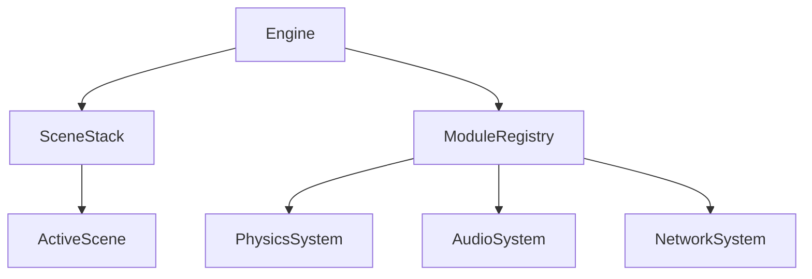

# Starlight Engine: Elite Technical Architecture 🏗️

// This project is AI-driven with human creative vision.

This document details the "skeleton" of the engine and the engineering decisions that ensure the AAA performance of the **Starlight Engine**.

---

## 1. Modular Core (EngineModule)
The engine is composed of independent modules that inherit from `EngineModule`. This allows systems like **Audio**, **Physics**, and **Network** to be toggled on or off as needed.

## 2. Rendering Pipeline (Hybrid PBR)
The `Renderer.cpp` implements a hybrid pipeline:
- **Deferred G-Buffer**: For dynamic lights and AO.
- **Forward+**: For transparencies and special materials.
- **Clustered Lighting**: Manages hundreds of point lights with O(log N) cost.

### Post-Processing Features:
- **SSR**: Screen-Space Reflections.
- **SSGI**: Simplified Global Illumination.
- **Bloom**: High-quality Gaussian filter.
- **ACES**: Cinema-standard tone mapping.

## 3. Accelerated Mathematics (SIMD AVX2)
We use Intel intrinsic instructions to accelerate CPU bottlenecks.
- **Memory Alignment**: Data structures are 32-byte aligned to avoid cache misses and allow direct vector loading.
- **Parallel Transformation**: A single `_mm256_mul_ps` instruction processes multiple vertices simultaneously.

## 4. Virtual File System (VFS)
The VFS abstracts the physical location of files.
- **Mount Points**: `@assets` can point to a local folder during development and to an encrypted `.pak` file in production.
- **Thread Safety**: Asset loading is thread-safe, allowing Background Loading.

## 5. Scripting & AI (Lua/Sol2)
High-level logic is exposed to **Lua 5.4**.
- **Bindings**: We use `sol2` to expose C++ components directly to the script.
- **Behavior Trees**: AI system that allows complex NPC behaviors without overloading the CPU.

---
*The Starlight Engine architecture was designed to be extensible, fast, and, above all, reliable for commercial applications.*
