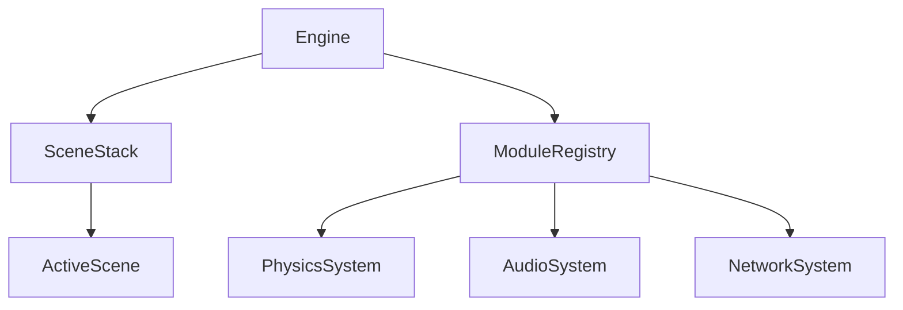

# Starlight Engine: Elite Technical Architecture 🏗️

// This project is AI-driven with human creative vision.

This document details the "skeleton" of the engine and the engineering decisions that ensure the AAA performance of the **Starlight Engine**.

---

## 1. Modular Core (EngineModule)
The engine is composed of independent modules that inherit from `EngineModule`. This allows systems like **Audio**, **Physics**, and **Network** to be toggled on or off as needed.

```mermaid
graph TD
    Engine --> SceneStack
    Engine --> ModuleRegistry
    ModuleRegistry --> PhysicsSystem
    ModuleRegistry --> AudioSystem
    ModuleRegistry --> NetworkSystem
    SceneStack --> ActiveScene
```

## 2. Rendering Pipeline (Modular RenderGraph)
The engine utilizes an advanced **RenderGraph** system, which decouples rendering passes and manages resource dependencies automatically.
- **Deferred G-Buffer**: High-performance base for dynamic lights and SSAO.
- **Cascaded Shadow Maps (CSM)**: Support for 4 cascades with stable fit and soft filtering.
- **Forward+**: Optimized for transparencies and complex materials.
- **Clustered Lighting**: Manages hundreds of point lights with O(log N) cost.

### Post-Processing Suite:
- **SSAO**: Screen-Space Ambient Occlusion with temporal stability.
- **SSR**: Screen-Space Reflections.
- **Bloom**: Multi-pass physical bloom.
- **ACES**: Cinema-standard tone mapping.

## 3. Parallel Execution (JobSystem)
We integrate the **Wicked Engine JobSystem** for high-performance multi-threading.
- **Fiber-based**: Efficient task switching with minimal overhead.
- **Worker Threads**: Automatically scaled to the number of CPU cores.
- **Dependencies**: Support for complex task graphs (e.g., Physics -> Culling -> Render).

## 3. Accelerated Mathematics (SIMD AVX2)
We use Intel intrinsic instructions to accelerate CPU bottlenecks.
- **Memory Alignment**: Data structures are 32-byte aligned to avoid cache misses and allow direct vector loading.
- **Parallel Transformation**: A single `_mm256_mul_ps` instruction processes multiple vertices simultaneously.

## 4. Virtual File System (VFS)
The VFS abstracts the physical location of files.
- **Mount Points**: `@assets` can point to a local folder during development and to an encrypted `.pak` file in production.
- **Thread Safety**: Asset loading is thread-safe, allowing Background Loading.

## 5. Scripting & AI (Lua/Sol2)
High-level logic is exposed to **Lua 5.4**.
- **Bindings**: We use `sol2` to expose C++ components directly to the script.
- **Behavior Trees**: AI system that allows complex NPC behaviors without overloading the CPU.

---
*The Starlight Engine architecture was designed to be extensible, fast, and, above all, reliable for commercial applications.*
