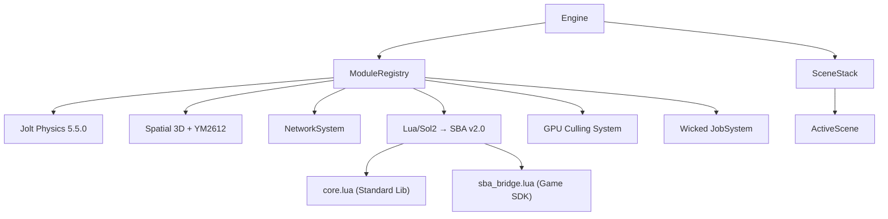
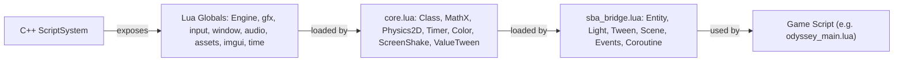

# Starlight Engine: Technical Architecture 🏗️

> This project is AI-driven with human creative vision.

This document details the engineering architecture of the **Starlight Engine (Fusion Core)**.

---

## 1. Modular Core (EngineModule)

The engine is composed of independent modules that inherit from `EngineModule`. Systems like **Audio**, **Physics**, and **Network** can be toggled on or off as needed.

```mermaid
graph TD
    Engine --> SceneStack
    Engine --> ModuleRegistry
    ModuleRegistry --> PhysicsSystem["Jolt Physics 5.5.0"]
    ModuleRegistry --> AudioSystem["Spatial 3D + YM2612"]
    ModuleRegistry --> NetworkSystem
    ModuleRegistry --> ScriptSystem["Lua/Sol2 → SBA v2.0"]
    ModuleRegistry --> GPUCulling["GPU Culling System"]
    ModuleRegistry --> JobSystem["Wicked JobSystem"]
    SceneStack --> ActiveScene
    ScriptSystem --> CoreLua["core.lua (Standard Lib)"]
    ScriptSystem --> SBABridge["sba_bridge.lua (Game SDK)"]
```

## 2. Rendering Pipeline (Modular RenderGraph)

The engine utilizes an advanced **RenderGraph** system which decouples rendering passes and manages resource dependencies automatically.

| Pass | Description |
|------|-------------|
| **G-Buffer** | Deferred rendering base: position, normal, albedo, PBR |
| **CSM Shadows** | 4 cascades at 2048x2048 with stable fit and PCF |
| **Lighting** | PBR with IBL, metallic/roughness workflow |
| **SSAO** | Screen-Space Ambient Occlusion with temporal stability |
| **SSR** | Screen-Space Reflections via raymarching |
| **Bloom** | Multi-pass physical bloom with HDR extraction |
| **Tone Mapping** | ACES cinema-standard color grading |
| **Renderer2D** | Batched quad/sprite rendering for UI and 2D games |
| **GPU Culling** | Frustum + occlusion culling on compute shaders |

## 3. Parallel Execution (JobSystem)

We integrate the **Wicked Engine JobSystem** for high-performance multi-threading.
- **Fiber-based**: Efficient task switching with minimal overhead.
- **Worker Threads**: Automatically scaled to CPU core count.
- **Dependencies**: Complex task graphs (Physics → Culling → Render).

## 4. Virtual File System (VFS)

The VFS abstracts file locations for seamless development/production transitions.
- **Mount Points**: `@assets` points to local folder (dev) or encrypted `.pak` (production).
- **Thread Safety**: Asset loading is fully thread-safe for background streaming.

## 5. Scripting Architecture

```mermaid
graph LR
    CPP["C++ ScriptSystem"] -->|exposes| LuaAPI["Lua Globals: Engine, gfx, input, window, audio, assets, imgui, time"]
    LuaAPI -->|loaded by| CoreLua["core.lua: Class, MathX, Physics2D, Timer, Color, ScreenShake, ValueTween"]
    CoreLua -->|loaded by| SBA["sba_bridge.lua: Entity, Light, Tween, Scene, Events, Coroutine"]
    SBA -->|used by| GameScript["Game Script (e.g. odyssey_main.lua)"]
```

### Layer Stack:
1. **C++ Layer**: Raw engine bindings (`Engine.spawn`, `Engine.set_pos`, `gfx.draw_rect`)
2. **core.lua**: Standard library (math, physics, timers, colors, tweening)
3. **sba_bridge.lua**: High-level SDK (Entity OO, Scene Manager, Event Bus)
4. **Game Script**: Pure gameplay logic, no engine internals

## 6. Input System

SDL2-based with **semantic action binding**:
- Raw keycodes → named actions (`W` → input, `MouseLeft` → click)
- API: `input.is_down()`, `input.is_just_pressed()`, `input.get_mouse_x/y()`
- 3D Mouse Raycasting: `Engine.get_mouse_hit()` for world-space picking

---
*The Starlight Engine architecture is designed to be extensible, fast, and reliable for commercial applications.*
