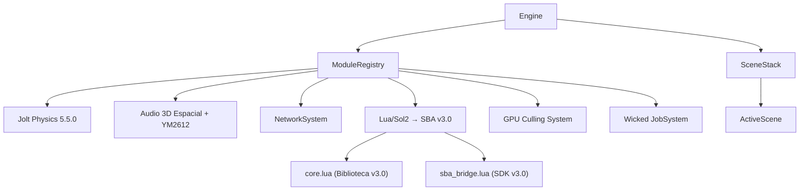
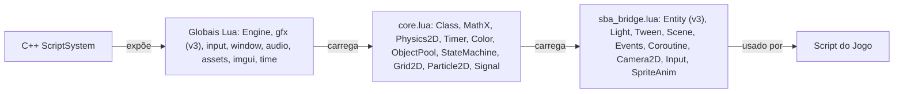

# Starlight Engine: Arquitetura Técnica 🏗️

> Este projeto é feito por IA e só o prompt é feito por um humano.

Este documento detalha a arquitetura de engenharia da **Starlight Engine (Fusion Core)**.

---

## 1. Core Modular (EngineModule)

A engine é composta de módulos independentes que herdam de `EngineModule`. Sistemas como **Audio**, **Physics** e **Network** podem ser ativados/desativados conforme necessário.

## 2. Pipeline de Renderização (RenderGraph Modular)

| Passo | Descrição |
| ----- | ----------- |
| **G-Buffer** | Base deferred: posição, normal, albedo, PBR |
| **CSM Shadows** | 4 cascatas em 2048x2048 com PCF |
| **Iluminação** | PBR com IBL, workflow metallic/roughness |
| **SSAO** | Oclusão ambiental com estabilidade temporal |
| **SSR** | Reflexões via raymarching |
| **Bloom** | Bloom físico multi-pass com extração HDR |
| **Tone Mapping** | ACES cinema-standard |
| **Renderer2D** | Primitivas batched (Retângulo, Círculo, Linha) e Sprites |
| **GPU Culling** | Frustum + occlusion culling em compute shaders |

## 3. Execução Paralela (JobSystem)

- **Wicked Engine JobSystem** com fiber-based task switching.
- Workers auto-escalados para os cores da CPU.
- Suporte a grafos de dependência (Physics → Culling → Render).

## 4. Sistema de Arquivos Virtual (VFS)

- **Mount Points**: `@assets` aponta para pasta local (dev) ou `.pak` encriptado (produção).
- **Thread Safety**: Carregamento de assets totalmente thread-safe.

## 5. Arquitetura de Scripting

### Camadas (v3.0)

1. **C++**: Bindings crus da engine (`gfx.draw_circle`, etc)
2. **core.lua**: Biblioteca padrão (matemática, física, timers, cores, tweening)
3. **sba_bridge.lua**: SDK de alto nível (Entity OO, Scene Manager, Event Bus)
4. **Script do Jogo**: Lógica pura de gameplay

## 6. Sistema de Input

SDL2 com **binding de ações semânticas**:

- `input.is_down()`, `input.is_just_pressed()`, `input.get_mouse_x/y()`
- Raycasting 3D do mouse: `Engine.get_mouse_hit()`

---
*A arquitetura da Starlight Engine foi projetada para ser extensível, rápida e confiável para aplicações comerciais.*
