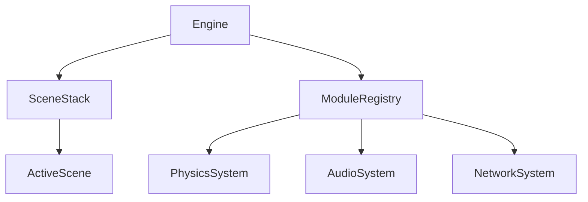

# Starlight Engine: Arquitetura Técnica de Elite 🏗️

// Este projeto é feito por IA e só o prompt é feito por um humano.

Este documento detalha o "esqueleto" do motor e as decisões de engenharia que garantem a performance AAA do **Fusion ENGINE**.

---

## 1. Núcleo Modular (EngineModule)
O motor é composto por módulos independentes que herdam de `EngineModule`. Isso permite que sistemas como **Áudio**, **Física** e **Rede** sejam ligados ou desligados conforme a necessidade do projeto.

## 2. Pipeline de Renderização (RenderGraph Modular)
O motor utiliza um sistema avançado de **RenderGraph**, que desacopla as passagens de renderização e gerencia dependências de recursos automaticamente.
- **Deferred G-Buffer**: Base de alta performance para luzes dinâmicas e SSAO.
- **Cascaded Shadow Maps (CSM)**: Suporte a 4 cascatas com filtragem suave para sombras de longa distância.
- **Forward+**: Otimizado para transparências e materiais complexos.
- **Clustered Lighting**: Gerencia centenas de luzes pontuais com custo O(log N).

### Suíte de Pós-Processamento:
- **SSAO**: Oclusão ambiental com estabilidade temporal.
- **SSR**: Reflexos baseados em Screen-Space.
- **Bloom**: Blur gaussiano multi-passagem de alta qualidade.
- **ACES**: Tone mapping padrão de cinema.

## 3. Execução Paralela (JobSystem)
Integramos o **Wicked Engine JobSystem** para multi-threading de alta performance.
- **Fiber-based**: Troca de tarefas eficiente com overhead mínimo.
- **Worker Threads**: Escalado automaticamente para o número de núcleos da CPU.
- **Dependências**: Suporte a grafos de tarefas complexos (ex: Física -> Culling -> Render).

## 3. Matemática Acelerada (SIMD AVX2)
Utilizamos instruções intrínsecas da Intel para acelerar o gargalo da CPU.
- **Alinhamento de Memória**: Estruturas de dados são alinhadas em 32-bytes para evitar "cache misses" e permitir carregamento vetorial direto.
- **Transformação Paralela**: Uma única instrução `_mm256_mul_ps` processa múltiplos vértices simultaneamente.

## 4. Virtual File System (VFS)
O VFS permite abstrair a localização física dos arquivos.
- **Mount Points**: `@assets` pode apontar para uma pasta local no desenvolvimento e para um arquivo criptografado `.pak` na produção.
- **Thread Safety**: O carregamento de assets é thread-safe, permitindo streaming de texturas em segundo plano (Background Loading).

## 5. Scripting & IA (Lua/Sol2)
A lógica de alto nível é exposta para **Lua 5.4**.
- **Math Bindings**: Suporte nativo para construtores globais `vec3(...)` e `quat(...)`, permitindo sintaxe premium e intuitiva para desenvolvedores.
- **ECS Integration**: Acesso direto ao EnTT Registry via Lua, permitindo criação e manipulação dinâmica de entidades.
- **Behavior Trees**: Sistema de IA que permite comportamentos complexos de NPCs.
- **Navigation (A*)**: Sistema de navegação de alta performance utilizando buffers persistentes para minimizar alocações de memória (`zero-allocation` durante a busca de caminhos).

## 6. Ferramental & Estúdio (EditorSystem)
O **EditorSystem** é integrado ao ciclo de vida da Engine sem comprometer a performance do jogo final.
- **Singleton Lifecycle**: Gerenciamento seguro de memória para sistemas estáticos, garantindo desligamento limpo.
- **ImGui Suite**: Interface de estúdio completa (Inspector, Hierarchy, Console) que pode ser alternada em tempo real via **F2**.

---
*A arquitetura da Starlight Engine foi desenhada para ser extensível, rápida e, acima de tudo, confiável para aplicações comerciais.*
