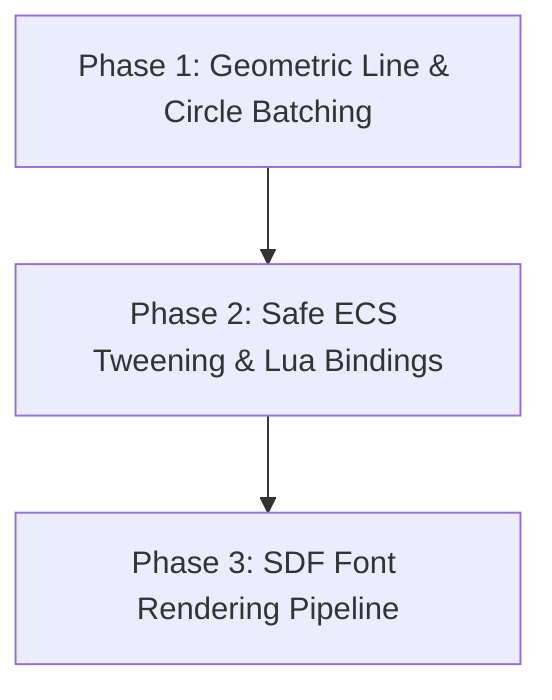

# Fusion ENGINE — Game Frameworks Comparison & Implementation Roadmap

This document analyzes popular game development frameworks (Raylib, SFML, Love2D, MonoGame, and Cocos2d-x) to identify valuable features missing from **Fusion ENGINE** (StarlightEngine). It outlines a multi-phase C++20 roadmap to integrate these features, enhancing usability, rapid prototyping, and high-performance gameplay logic.

---

## 1. Technical Framework Comparison

| Feature / System | Raylib | SFML | Love2D | MonoGame | Cocos2d-x | Fusion ENGINE (Ours) |
| :--- | :--- | :--- | :--- | :--- | :--- | :--- |
| **Primary Language** | C / C++ | C++ | Lua (C/C++ core) | C# | C++ / Lua / JS | C++20 (Lua scripting) |
| **Geometry Drawing** | Immediate (DrawLine, DrawCircle) | VertexArrays (RectangleShape, etc.) | Immediate (`love.graphics.line`) | Batched SpriteBatch lines | Node-based DrawNode primitives | Batched Quads/Triangles/RoundedRects |
| **Tweening & Actions** | External library | External / Manual | External (Flux/Tween) | External / Manual | Native Actions (MoveTo, Rotate, Scale) | C++ target pointer Tween system |
| **Font Rendering** | TTF/OTF & SDF (Signed Distance Fields) | TTF/OTF bitmap font | TTF/OTF bitmap font | XML/Compiled SpriteFont | TTF, BMFont, and System Fonts | Basic bitmap ASCII font |
| **Keyboard/Mouse API** | Immediate (`IsKeyPressed`) | Window events / Input state | Event callbacks & state | State structs (`GetState`) | Event Listeners & callbacks | Immediate InputSystem checks |
| **Network Protocol** | None | SFML-network (TCP/UDP socket wrappers) | Socket libraries (LuaSocket) | TCP/UDP sockets | WebSocket / HTTP Client | UDP Socket wrapper system |

---

## 2. Identified Feature Gaps

### 2.1 Geometric Primitives Drawing (SFML / Raylib / Love2D)

- **Framework standard**: Frameworks like Raylib and Love2D allow developers to easily draw lines, circles, and curves in world coordinates or screen space with a single line of code (e.g., `DrawCircle(x, y, radius, color)`).
- **Fusion ENGINE Gap**: Our `Renderer2D` is highly efficient and optimized for batched sprites, rounded rectangles, and triangles, but lacks native functions to batch-render **lines with custom thickness** and **circles with fine-grained segment subdivisions**.

### 2.2 ECS Tweening & Node Actions (Cocos2d-x / Love2D)

- **Framework standard**: Cocos2d-x relies heavily on sequential and parallel actions (e.g., `MoveTo::create(duration, position)`) that automate visual changes. Love2D relies on easy-to-use Lua tweening libraries (e.g., Flux) to animate entity properties.
- **Fusion ENGINE Gap**: StarlightEngine has a `TweenSystem` in C++, but it is limited to raw float target pointers (`float* target`). Because EnTT registry allocations can move components in memory, keeping raw pointers to component data is highly unsafe. Furthermore, there is no scripting interface to trigger entity animations (moving, scaling, rotating) easily from Lua.

### 2.3 SDF (Signed Distance Field) Font Rendering (Raylib)

- **Framework standard**: Raylib has built-in support for SDF font generation and rendering. This allows fonts to scale up infinitely with pristine edges and zero pixelation or blurry artifacts.
- **Fusion ENGINE Gap**: Our engine's font renderer inside `Renderer2D` uses simple bitmap character atlases. Scaling up text makes characters blurry and blocky.

---

## 3. Evolutionary C++20 Integration Roadmap

To bridge these gaps, we propose a 3-phase technical roadmap tailored to our C++20 ECS/Lua architecture.

### Phase 1: Geometric Line & Circle Batching (Raylib / SFML style)

- **Batched Line Rendering**:
  - Extend `Renderer2D` to support `DrawLine(const glm::vec2& p0, const glm::vec2& p1, float thickness, const glm::vec4& color, int layer)`.
  - Calculate line perpendiculars to construct a quad dynamically and send it to the existing batch renderer, avoiding extra draw calls.
- **Batched Circle Rendering**:
  - Extend `Renderer2D` to support `DrawCircle(const glm::vec2& center, float radius, const glm::vec4& color, int layer)`.
  - Subdivide the circle perimeter into segments (e.g., 32 segments) and batch-render them as connected triangles or quads.

### Phase 2: Safe ECS Tweening (Cocos2d-style)

- **Safe Entity Tweening Container**:
  - Add an `EcsTween` structure containing `entt::entity`, target property type (Position, Scale, etc.), start/end vectors, duration, elapsed time, and easing functions.
  - Refactor `TweenSystem` to hold a list of `EcsTween` and update components safely by querying EnTT registry using `reg.valid(entity)` and `reg.get<TransformComponent>(entity)`.
- **Sol2 Lua Bindings**:
  - Expose the `EcsTween` and easing function names to Lua via the `Engine` table.
  - Add scripting APIs: `Engine.tween_position(entity, startX, startY, startZ, endX, endY, endZ, duration, easeName)` and `Engine.tween_scale(...)`.

### Phase 3: SDF Font Rendering Pipeline (Raylib style)

- **SDF Shader Integration**:
  - Write a Signed Distance Field fragment shader for text rendering using smoothstep functions for sharp edges.
  - Expose SDF text rendering functions in `Renderer2D`.
