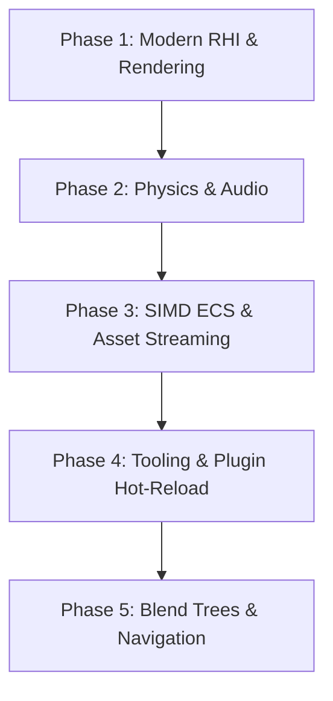

# Fusion ENGINE — Market Engine Comparison & Evolution Roadmap

This document provides a detailed technical comparison between **Fusion ENGINE** (StarlightEngine) and leading commercial/open-source game engines (Unreal Engine 5, Unity, Godot 4, Defold, and Wicked Engine). Based on this analysis, we lay out a multi-phase C++20 roadmap to elevate Fusion ENGINE to industrial-grade feature parity while preserving its core identity as a fast, data-oriented (ECS), Jolt-powered, and Lua-scripted game engine.

---

## 1. Technical Comparison Table

| Feature Domain | Unreal Engine 5 | Unity | Godot 4 | Defold | Wicked Engine | Fusion ENGINE (Ours) |
| :--- | :--- | :--- | :--- | :--- | :--- | :--- |
| **Primary Language** | C++ | C# | GDScript / C# | C++ (Lua scripting) | C++ (Lua scripting) | C++20 (Lua scripting) |
| **API Backends** | DX12, Vulkan, Metal | DX12, Vulkan, Metal | Vulkan, DX12, GLES3 | Vulkan, OpenGL, Metal | DX12, Vulkan, DX11 | OpenGL (glad) |
| **Architecture** | OOP / Actor & Mass (ECS) | OOP / DOTS (Pure ECS) | Node Hierarchy (OOP) | Component-based (OOP) | Flat OOP / Component | EnTT (Registry ECS) |
| **Job System** | Task Graph (Work-stealing) | C# Job System | Multithreaded Servers | Single-threaded engine | wi::jobsystem | wiJobSystem (Work-stealing) |
| **Physics Engine** | Chaos Physics | PhysX / Unity Physics | GodotPhysics / Jolt | Box2D / 3D Physics | Jolt Physics | Jolt Physics wrapper |
| **Scripting VM** | Blueprints (VM) | Mono / IL2CPP | GDScript VM / Mono | LuaJIT | Lua VM | Sol2 (Lua VM) |
| **Asset Packaging** | Pak / IO Store | Asset Bundles | PCK Archives | ZIP / Defold archive | Custom ZIP | ZIP / TPAK (VFS) |
| **Global Illumination** | Lumen (SDF Raytracing) | Raytracing / Lightmaps | SDFGI, VoxelGI, Lightmaps | Baked Lightmaps | Ray-traced / Voxel GI | GPU-driven IBL / Light probes |
| **Animation** | Control Rig, Anim Graph | Mecanim | AnimationMixer | Sprite/Bone Animation | ozz-animation | ozz-animation wrapper |
| **Audio Pipeline** | MetaSounds | DSP Audio Mixer | Audio Effects bus | Basic Sound/Buffer | miniaudio mixer | miniaudio wrapper |
| **Tooling & Editor** | Unreal Engine 5 Editor (Slate/Qt) | Unity Editor (IMGUI/UIE) | Godot Editor (Custom UI) | Defold Editor (Clojure) | Wicked Editor (ImGui) | In-game Editor (ImGui) |

---

## 2. In-Depth Gap Analysis

### 2.1 Rendering & RHI Layer

- **Market Leaders (Unreal 5, Unity, Godot 4, Wicked Engine)**: Abstract rendering into a hardware-independent **RHI (Render Hardware Interface)** layer. This lets them leverage Vulkan, DirectX 12, or Metal natively to issue multi-threaded draw calls, bindless resources, and utilize hardware ray-tracing pipelines.
- **Fusion ENGINE Gap**: Currently bound directly to OpenGL 4.6 (via glad). While OpenGL is highly compatible and simple, it lacks multi-threaded command buffers, bindless textures, and ray-tracing pipelines. Additionally, forward clustered rendering is present, but lacks a deferred shading alternative for handling extremely complex scenes with thousands of lights.

### 2.2 ECS & Job System

- **Market Leaders (Unity DOTS, Unreal MassEntity)**: Cache-friendly pure ECS layout utilizing compile-time codegen (Burst Compiler in Unity) and SIMD vectorization to execute millions of entity updates in parallel.
- **Fusion ENGINE Gap**: StarlightEngine uses **EnTT**, which is an excellent sparse-set ECS. However, the systems are not yet vector-optimized with SIMD intrinsics (AVX2/AVX-512) for particle math, bounding volume updates, or transforms.

### 2.3 Physics & Animation

- **Market Leaders (Wicked Engine, Godot Jolt)**: Full Jolt Physics integration, including ragdoll skeleton binding, soft body deformation, cloth simulation, and dynamic character controllers.
- **Fusion ENGINE Gap**: StarlightEngine wraps Jolt for basic colliders, rigidbodies, and raycasting. However, character movement uses simplified math rather than Jolt's virtual/physical character controllers, and there is no native ragdoll or cloth-to-physics binding.

### 2.4 Tooling & Scripting Hot-Reload

- **Market Leaders (Unreal, Godot, Unity)**: Supports hot-reloading code (C# Mono, C++ live coding, or GDExtension DLLs) and live-editing assets in a standalone IDE.
- **Fusion ENGINE Gap**: Fusion ENGINE supports hot-reloading Lua scripts and shaders, but modifying C++ systems requires rebuilding the entire engine and restarting the game executable.

---

## 3. Evolutionary C++20 Roadmap

We divide the roadmap into 5 sequential phases. All rendering features *must* adhere to our signature **Outrun / Retro Synthwave Cyberpunk style** (obsidian surfaces, neon violet meshes, hot magenta spotlights, and cyber cyan particle systems).

### Phase 1: Modern RHI Layer & Advanced Rendering

- **RHI Layer Abstraction**:
  - Create `RenderDevice`, `CommandBuffer`, and `Pipeline` interfaces.
  - Implement an OpenGL 4.6 backend as the default driver.
  - Lay the groundwork for a Vulkan 1.3 backend.
- **Clustered Deferred Shading**:
  - Add a deferred rendering pass (G-Buffer) alongside the clustered forward renderer.
  - Store Albedo, Normals, Roughness/Metallic/AO, and Depth.
- **Temporal Anti-Aliasing (TAA) & Upscaling**:
  - Write a native TAA shader in OpenGL/Vulkan using jittered projection matrices and history accumulation.
  - Integrate AMD FSR 2.2 / 3.0 C++ SDK to allow high-fidelity rendering upscaling.
- **Premium Outrun Visuals**:
  - Upgrade SSR (Screen-Space Reflections) to use Fresnel Cook-Torrance glossy lookups.
  - Integrate dynamic volumetric neon light shafts (sunset orange and hot magenta cones).

### Phase 2: Jolt Physics Extension & Spatial Audio

- **Jolt Character Controllers**:
  - Replace legacy kinematic physics with `Jolt::CharacterVirtual` to handle steps, slopes, slopes slide, and sliding forces natively.
- **Ragdoll & Soft Body Systems**:
  - Implement `RagdollSystem` linking ozz-animation bone hierarchies to Jolt capsule rigidbodies.
  - Implement Jolt-driven soft body structures for neon cloth banners and interactive foliage.
- **HRTF 3D Spatial Audio**:
  - Extend `AudioSystem` with miniaudio's spatial audio engine.
  - Apply HRTF (Head-Related Transfer Function) filters for 3D sound positioning.
  - Define Reverb Zones (`ReverbZoneComponent`) using a Jolt trigger check to apply environment reverb filters on-the-fly.

### Phase 3: SIMD ECS Optimization & Asset Streaming

- **SIMD Vectorization**:
  - Implement AVX2 optimized updates for particle math in `ParticleSystem`.
  - Vectorize frustum culling and bounding box (AABB) intersection routines.
- **Asset Streaming Pipeline**:
  - Upgrade the asset loading system to load textures and meshes asynchronously from ZIP/PAK archives on background threads (leveraging `wiJobSystem`).
  - Introduce MIP-map streaming for textures, loading high-res texture blocks only when close to the camera.
- **ECS Prefabs**:
  - Define a JSON-based prefab format allowing nested entity hierarchies with overrides.
  - Update `SceneSerializer` to instantiate prefabs dynamically via Sol2 script commands.

### Phase 4: Industrial Tooling & DLL Plugin Hot-Reload

- **C++ Plugin System**:
  - Introduce `IPlugin` interface allowing developers to write game logic in standalone `.dll` / `.so` libraries.
  - Implement runtime hot-reloading: loading DLLs, unloading them, and re-linking function pointers at runtime without closing the engine.
- **Visual Node Shader Editor**:
  - Integrate `imnodes` within the engine's editor dashboard.
  - Let developers drag and drop nodes (textures, math, variables, lighting) and compile them dynamically to GLSL shader files.
- **Visual Behavior Tree Editor**:
  - Expose `BehaviorTree` nodes to an ImGui visual graph, allowing game designers to construct NPC AI logic visually and save directly to Lua scripts.

### Phase 5: Advanced Animation & AI

- **Animation Blend Trees**:
  - Build an animation mixer inside `SpriteAnimationSystem` and 3D anim systems.
  - Support 1D and 2D blend trees (blending walk/run/strafe cycles using speed and direction CVars).
- **Terrain Inverse Kinematics (IK)**:
  - Implement a two-bone foot IK system in C++ using Jolt raycasts to align character feet to uneven slopes in real-time.
- **Dynamic NavMesh & Agent Avoidance**:
  - Integrate Recast Navigation to build navigation meshes dynamically from loaded GLTF models.
  - Implement ORCA (Optimal Reciprocal Collision Avoidance) / RVO2 for collision-free multi-agent crowd simulation.
