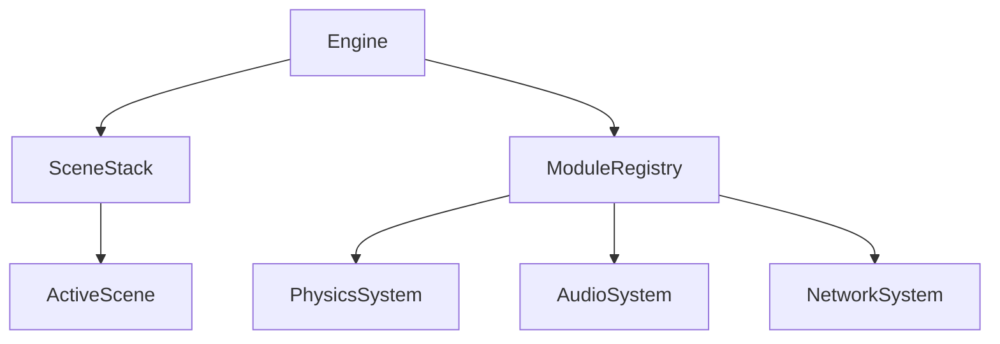

# TitanEngine: Arquitetura Técnica de Elite 🏗️

// Este projeto é feito por IA e só o prompt é feito por um humano.

Este documento detalha o "esqueleto" do motor e as decisões de engenharia que garantem a performance AAA do **Fusion ENGINE**.

---

## 1. Núcleo Modular (EngineModule)
O motor é composto por módulos independentes que herdam de `EngineModule`. Isso permite que sistemas como **Áudio**, **Física** e **Rede** sejam ligados ou desligados conforme a necessidade do projeto.

## 2. Pipeline de Renderização (Hybrid PBR)
O `Renderer.cpp` implementa um pipeline híbrido:
- **Deferred G-Buffer**: Para luzes dinâmicas e AO.
- **Forward+**: Para transparências e materiais especiais.
- **Clustered Lighting**: Gerencia centenas de luzes pontuais com custo O(log N).

### Recursos de Pós-Processamento:
- **SSR**: Reflexos baseados em Screen-Space.
- **SSGI**: Iluminação global simplificada.
- **Bloom**: Filtro gaussiano de alta qualidade.
- **ACES**: Tone mapping padrão de cinema.

## 3. Matemática Acelerada (SIMD AVX2)
Utilizamos instruções intrínsecas da Intel para acelerar o gargalo da CPU.
- **Alinhamento de Memória**: Estruturas de dados são alinhadas em 32-bytes para evitar "cache misses" e permitir carregamento vetorial direto.
- **Transformação Paralela**: Uma única instrução `_mm256_mul_ps` processa múltiplos vértices simultaneamente.

## 4. Virtual File System (VFS)
O VFS permite abstrair a localização física dos arquivos.
- **Mount Points**: `@assets` pode apontar para uma pasta local no desenvolvimento e para um arquivo criptografado `.pak` na produção.
- **Thread Safety**: O carregamento de assets é thread-safe, permitindo streaming de texturas em segundo plano (Background Loading).

## 5. Scripting & IA (Lua/Sol2)
A lógica de alto nível é exposta para **Lua 5.4**.
- **Bindings**: Usamos `sol2` para expor componentes C++ diretamente para o script.
- **Behavior Trees**: Sistema de IA que permite comportamentos complexos de NPCs sem sobrecarregar a CPU.

---
*A arquitetura da TitanEngine foi desenhada para ser extensível, rápida e, acima de tudo, confiável para aplicações comerciais.*
